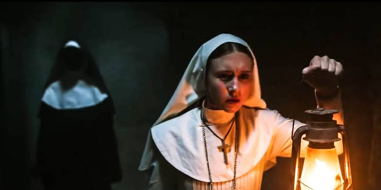
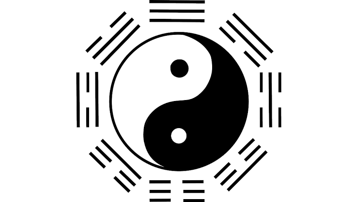
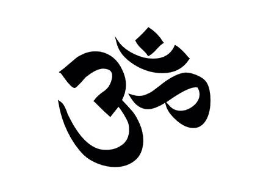
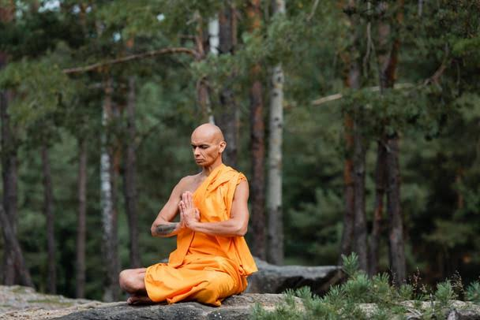
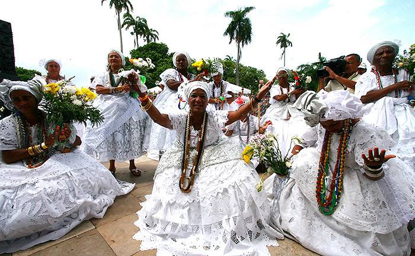

<html lang="pt-br">
  <head>
    <meta charset="UTF-8">
    <meta name="viewport" content="width=device-width, initial-scale=1, maximum-scale=1.0">
    <title></title>
    
	</head>
	<body>
	     <h2>Mera Semelhança</h2>
	     
Oque a de igual nas principais religiões do mundo? um breve estudo sobre elas e da pra ligar todos os pontos.

	     
	     <h2>Catolicismo Romano</h2>
	     <i>1,2 bilhão Praticantes<i>
	     
	     
Em questão aqui vou analisar as vestimentas usadas pelas <mark>freiras</mark> e também pelos padres e o papa. As cores preto e branca sempre trouxe um símbolismo de dualidade mais abaixo vou abordar mais sobre o assunto. Segundo a religião as irmãs que ainda não entregaram seus votos  usam o <mark>hábito branco e cobrem a cabeça com um véu branco</mark> por um ano.

	      
	      
	       
	      <i>Filme a Freira 2018<i>
	       
	      
O <mark>cocar preto</mark> usado por freiras cistercienses significa a sua "consagração a Deus", enquanto o hábito branco era usado para distinguir as irmãs da cor preta usada pelos irmãos da ordem.

	      
	      
No final o preto e branco se misturam como em um tabuleiro de xadrez. A próxima religião traz as mesmas cores e significados.
	      
	      <h2>Taoismo<h2>
	      <i>20 milhões de adeptos todo mundo<i>
	      
	      
A cor preta e branca não se faz presente apenas no símbolo yin-yang segundo a tradição desta religião o ajudante do sacerdote ou auxiliar se veste de branco enquanto o sacerdote usa preto. Outra parte similar ao catolicismo é a idolatria.
	        
A corrente que liga esta religião a outras duas é a meditação.

	      
	      
	      <h2>Hinduismo<h2>
	      <i>1 bilhão de adeptos<i>
	      
	      
Religião que se predomina em maior parte na índia com sua diversidade de Deuses Deusas, a prática da  yoga teve origem há 5 mil anos atrás na Índia, como uma disciplina espiritual e define-se como toda a prática que tenha como objetivo a evolução do Homem em todos os aspetos da sua existência. É uma prática que envolve o bem-estar a todos os níveis: mental, físico, emocional e espiritual que também se correlaciona com o Budismo.
	      <h2>Budismo</h2>
	      <i>500 milhões de seguidores<i>
	      
	      
Além das vestimentas dos monges que costumam ser pretas assim como as de um padre ou freira uma característica a se ressaltar é raspagem de cabeça oque nos leva as religiões de matrizes Africanas.
	      <h2>Umbanda</h2>
	      <i>432 mil adeptos<i>
	      
	      
	      
Segundo a religião o candidato à iniciação é mantido confinado em um quarto por 21 dias. Ele (ou ela) tem a cabeça raspada e recebe marcas no braço ou na cabeça, geralmente feitas com espinhas de peixe. Essas cicatrizes simbolizam a porta de entrada do orixá durante a incorporação.

	      
	      
Entre muitas religiões do mundo as principais tem algo em comun veja isto como quiser e do seu ponto de vista.

	      
	      
	</body>
</html>
